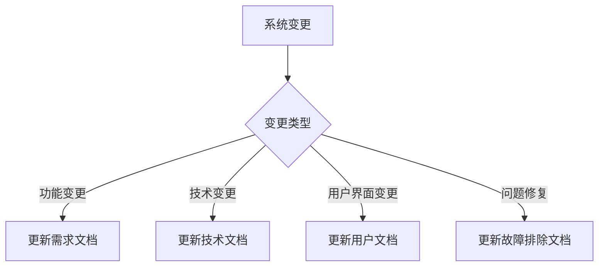

# MSH签到系统 - 文档更新和维护指南

## 📋 文档管理概述

**目的**：确保MSH签到系统文档的准确性、完整性和及时性  
**适用范围**：所有系统文档、需求文档、技术文档  
**更新频率**：实时更新，定期检查  
**维护者**：MSH系统管理员和开发团队  

## 🎯 文档更新原则

### **1. 实时更新原则**
- **功能变更时**：立即更新相关文档
- **用户反馈时**：及时更新需求文档
- **系统优化时**：更新技术文档
- **问题修复时**：更新故障排除文档

### **2. 准确性原则**
- **数据准确**：确保文档中的数据准确无误
- **信息完整**：确保文档信息完整不遗漏
- **版本一致**：确保文档与系统版本一致
- **逻辑清晰**：确保文档逻辑清晰易懂

### **3. 可维护性原则**
- **结构清晰**：文档结构清晰，便于维护
- **格式统一**：使用统一的文档格式
- **版本控制**：使用版本控制管理文档
- **备份保护**：重要文档多重备份

## 📝 文档分类和更新规则

### **1. 系统需求文档 (SYSTEM_REQUIREMENTS.md)**

#### **更新触发条件**
- 新增功能需求
- 修改现有功能
- 用户反馈需求变更
- 技术架构调整
- 性能要求变更

#### **更新内容**
```markdown
## 🔄 更新历史

### **版本 2.1 (2025-01-XX)**
- ✅ 新增功能：XXX
- 🔧 修改功能：XXX
- 🐛 修复问题：XXX
- 📈 性能优化：XXX
```

#### **更新流程**
1. **需求收集**：收集用户需求和反馈
2. **需求分析**：分析需求的可行性和影响
3. **文档更新**：更新需求文档
4. **版本标记**：标记文档版本和更新日期
5. **团队审核**：团队审核文档更新
6. **发布确认**：确认文档发布

### **2. 技术文档**

#### **API文档 (API_DOCUMENTATION.md)**
- **更新时机**：API接口变更时
- **更新内容**：接口参数、返回值、示例代码
- **验证方法**：接口测试验证

#### **部署文档 (DEPLOYMENT.md)**
- **更新时机**：部署流程变更时
- **更新内容**：部署步骤、环境要求、配置说明
- **验证方法**：部署测试验证

#### **维护文档 (MAINTENANCE.md)**
- **更新时机**：维护流程变更时
- **更新内容**：维护步骤、故障处理、性能优化
- **验证方法**：维护操作验证

### **3. 用户文档**

#### **用户手册 (USER_MANUAL.md)**
- **更新时机**：用户界面变更时
- **更新内容**：操作步骤、功能说明、常见问题
- **验证方法**：用户测试验证

#### **故障排除文档 (TROUBLESHOOTING.md)**
- **更新时机**：发现新问题或解决方案时
- **更新内容**：问题描述、解决方案、预防措施
- **验证方法**：问题复现和解决验证

## 🔄 文档更新流程

### **1. 变更识别**


### **2. 文档更新步骤**

#### **步骤1：变更分析**
- 分析变更的影响范围
- 确定需要更新的文档
- 评估更新的紧急程度
- 制定更新计划

#### **步骤2：内容更新**
- 更新相关文档内容
- 保持文档格式一致
- 添加版本标记
- 更新修改日期

#### **步骤3：质量检查**
- 检查内容准确性
- 验证格式正确性
- 确认信息完整性
- 测试链接有效性

#### **步骤4：审核发布**
- 团队内部审核
- 用户反馈收集
- 最终确认发布
- 版本控制提交

### **3. 版本控制**

#### **版本命名规则**
```
格式：主版本.次版本.修订版本_日期
示例：2.1.0_20250111
```

#### **版本说明**
- **主版本**：重大功能变更
- **次版本**：功能新增或修改
- **修订版本**：问题修复或小改进
- **日期**：更新日期（YYYYMMDD）

## 📊 文档质量保证

### **1. 内容质量标准**

#### **准确性要求**
- 信息必须准确无误
- 数据必须真实可靠
- 步骤必须可操作
- 示例必须可验证

#### **完整性要求**
- 信息必须完整不遗漏
- 步骤必须详细清晰
- 示例必须完整可用
- 链接必须有效可访问

#### **一致性要求**
- 格式必须统一规范
- 术语必须一致使用
- 风格必须保持一致
- 结构必须逻辑清晰

### **2. 质量检查清单**

#### **内容检查**
- [ ] 信息准确无误
- [ ] 内容完整不遗漏
- [ ] 逻辑清晰合理
- [ ] 语言表达准确

#### **格式检查**
- [ ] 格式统一规范
- [ ] 标题层次清晰
- [ ] 列表格式正确
- [ ] 代码格式规范

#### **链接检查**
- [ ] 内部链接有效
- [ ] 外部链接可访问
- [ ] 图片链接正常
- [ ] 文件链接正确

## 🔧 文档维护工具

### **1. 版本控制工具**
- **Git**：文档版本控制
- **GitHub**：文档托管和协作
- **GitHub Pages**：文档在线发布

### **2. 文档编辑工具**
- **Markdown编辑器**：专业Markdown编辑
- **VS Code**：代码和文档编辑
- **Typora**：所见即所得编辑

### **3. 质量检查工具**
- **Markdown Lint**：Markdown格式检查
- **Link Checker**：链接有效性检查
- **Spell Checker**：拼写检查

## 📅 维护计划

### **1. 日常维护**
- **每日检查**：检查文档链接有效性
- **每周检查**：检查文档内容准确性
- **每月检查**：全面检查文档质量

### **2. 定期更新**
- **季度更新**：更新系统概述和架构
- **半年更新**：更新技术文档和API文档
- **年度更新**：全面审查和更新所有文档

### **3. 应急更新**
- **系统故障时**：立即更新故障排除文档
- **安全漏洞时**：立即更新安全相关文档
- **用户反馈时**：及时更新用户文档

## 🚨 文档保护机制

### **1. 文件保护**
- **受保护文件**：在`.gitignore`中定义
- **备份策略**：多重备份重要文档
- **访问控制**：限制文档修改权限
- **版本控制**：保留文档历史版本

### **2. 内容保护**
- **版权声明**：添加版权和许可信息
- **水印标识**：重要文档添加水印
- **数字签名**：关键文档数字签名
- **访问日志**：记录文档访问日志

## 📞 联系和支持

### **文档维护团队**
- **技术文档**：开发团队负责
- **用户文档**：产品团队负责
- **需求文档**：产品经理负责
- **故障文档**：运维团队负责

### **反馈渠道**
- **GitHub Issues**：文档问题反馈
- **邮件反馈**：直接邮件反馈
- **用户反馈**：系统内置反馈功能
- **团队会议**：定期团队讨论

## 📋 检查清单

### **文档更新前检查**
- [ ] 确认更新需求明确
- [ ] 检查相关文档影响
- [ ] 准备更新内容
- [ ] 制定更新计划

### **文档更新后检查**
- [ ] 验证内容准确性
- [ ] 检查格式正确性
- [ ] 测试链接有效性
- [ ] 确认版本标记

### **文档发布前检查**
- [ ] 团队审核通过
- [ ] 用户测试通过
- [ ] 质量检查通过
- [ ] 版本控制提交

---
*本文档将根据文档管理实践持续更新优化*
